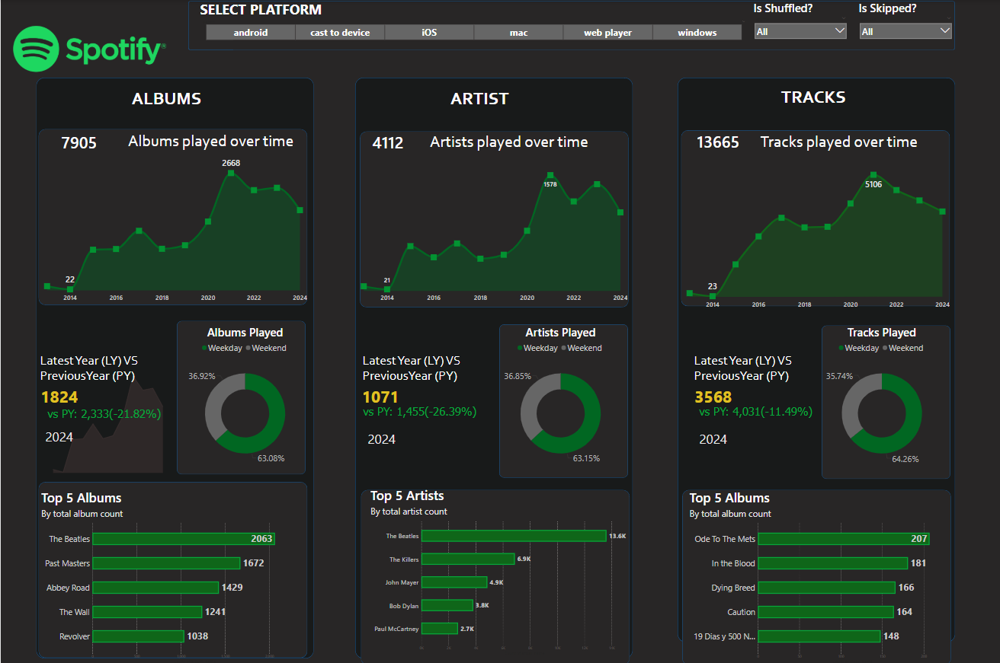
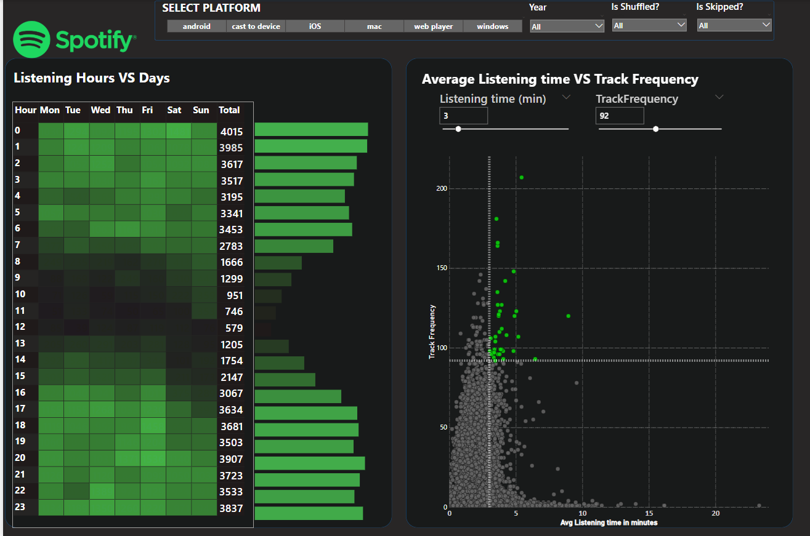
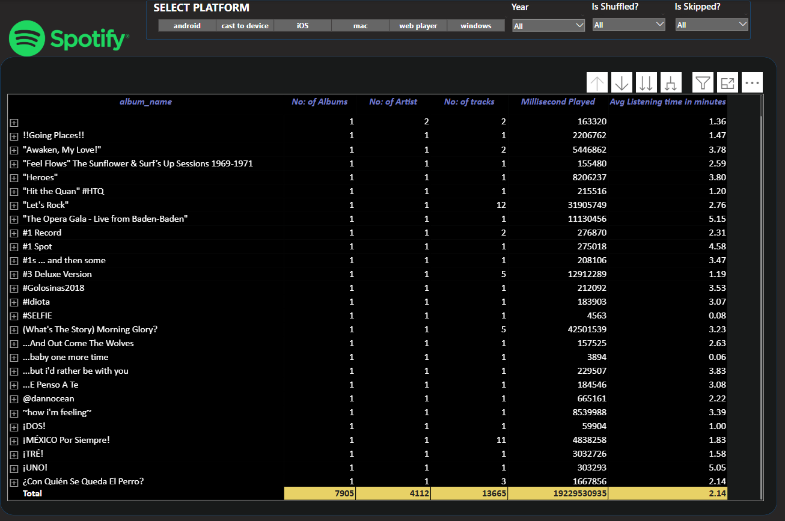

## 🎵 Spotify Listening Analysis - Power BI Dashboard

### 📌 Project Overview
This project analyzes Spotify listening history to identify patterns in album, artist, and track engagement over time. The interactive Power BI dashboard provides insights into listening trends, peak hours, and year-over-year comparisons.

### 🚀 Key Features & Insights
1. **Listening Patterns**  
   - 🔥 *Heatmap of Listening Hours vs Days*  
   - ⏳ *Average Listening Time vs Track Frequency Scatter Plot with Quadrant Analysis*  
     - **🎯 High Frequency & High Listening Time** – Most engaging tracks  
     - **📌 Low Frequency & High Listening Time** – Niche but impactful tracks  
     - **🔄 High Frequency & Low Listening Time** – Short & frequently played tracks  
     - **📉 Low Frequency & Low Listening Time** – Less popular tracks  

2. **Album Analysis**  
   - 📅 *Total Albums Played Over Time*  
   - 🔍 *Min & Max Album Listening Trends by Year*  
   - 📊 *Weekday vs Weekend Listening Patterns*  
   - 🏆 *Top 5 Albums Based on Play Frequency*  
   - 📈 *Year-over-Year Album Consumption Comparison*

3. **Artist & Track Analysis**  
   - 🎤 *Total Artists & Tracks Played Over Time*  
   - 🎶 *Annual Listening Trends for Artists & Tracks*  
   - 🔍 *Min & Max Listening Trends for Artists & Tracks*  
   - 🎧 *Top 5 Artists & Tracks*  
   - 📊 *Year-over-Year Analysis of Artist & Track Engagement*

4. **Data Exploration & Visualization**  
   - 📜 *Detailed Grid View for Albums, Artists & Tracks with Drill-through Functionality*  
   - 📊 *Dynamic Charts for Trends & Comparison Analysis*

---

## 🛠️ Power BI Implementation Details

### 1️⃣ Data Preparation & Quality Check  
✔️ Verified data using **Transform Data → Column Distribution & Quality Check**  
✔️ Ensured error-free columns before analysis  

### 2️⃣ Data Modeling  
🔗 Created a **Date Table** from timestamp using:  
```DAX
Track Played Time = FORMAT(Spotify_history[ts], "HH:MM:SS")
Track Played Date = DATE(YEAR(Spotify_history[ts]), MONTH(Spotify_history[ts]), DAY(Spotify_history[ts]))
Date table = CALENDAR(MIN(Spotify_history[Track Played Date]), MAX(Spotify_history[Track Played Date]))
YEAR = YEAR('Date table'[Date])
```
🔗 Established a **Many-to-One Relationship** between Spotify history and Date Table  

### 3️⃣ DAX Calculations for Insights  
📊 **Min & Max Values in Visuals**  
```DAX
min_max_albums_line_chart = 
VAR _MaxValue = MAXX(ALLSELECTED('Date table'[YEAR]), CALCULATE(DISTINCTCOUNT(Spotify_history[album_name])))
VAR _MinValue = MINX(ALLSELECTED('Date table'[YEAR]), CALCULATE(DISTINCTCOUNT(Spotify_history[album_name])))
VAR _CurrentValue = DISTINCTCOUNT(Spotify_history[album_name])

RETURN IF(_CurrentValue == _MaxValue || _CurrentValue == _MinValue, _CurrentValue, BLANK())
```
📆 **Latest Year vs Previous Year Album Count & YoY Change**  
```DAX
LatestYearAlbum = 
VAR _LatestYear = MAX('Date table'[YEAR])
RETURN CALCULATE(DISTINCTCOUNT(Spotify_history[album_name]), 'Date table'[YEAR] = _LatestYear)

PreviousYearAlbum = 
VAR _PreviousYear = MAX('Date table'[YEAR]) - 1
RETURN CALCULATE(DISTINCTCOUNT(Spotify_history[album_name]), 'Date table'[YEAR] = _PreviousYear)

YearOnYear Albums = 
VAR _latest = [LatestYearAlbum]
VAR _previous = [PreviousYearAlbum]
VAR _YoY = IF(NOT(ISBLANK(_previous)), DIVIDE(_latest - _previous, _previous, 0), BLANK())

RETURN IF(NOT(ISBLANK(_previous)), "vs PY: " & FORMAT(_previous, "#,##0") & " (" & FORMAT(_YoY, "0.00%") & ")", "No Data")
```
📅 **Weekday vs Weekend Listening Behavior**  
```DAX
DayType = IF(WEEKDAY(('Date table'[Date]), 2) <= 5, "Weekday", "Weekend")
```
📉 **Track Listening Scatter Plot Metrics**  
```DAX
Avg Listening time in minutes = AVERAGE(Spotify_history[ms_played]) / 60000
Track Frequency = COUNTROWS(Spotify_history)
```
🌈 **Quadrant Analysis for Track Engagement (Color Gradation in Scatter Plot)**  
```DAX
Quadrant = 
VAR AvgTime = [Avg Listening time in minutes] <= 'Listening time (min)'[Listening time (min) Value]
VAR TrackFreq = [Track Frequency] >= TrackFrequency[TrackFrequency Value]

VAR Result = 
    SWITCH(TRUE(),
            AvgTime && TrackFreq, 1, --Low Time High Frequency
            NOT AvgTime && TrackFreq, 2, --High Time High Frequency
            AvgTime && NOT TrackFreq, 3, --Low Time Low Frequency
            NOT AvgTime && NOT TrackFreq, 4 --High Time Low Frequency
    )
RETURN Result
```

---

## 📸 Dashboard Preview





---

## 📌 Files in This Repository
📂 `spotify_history.csv` - Dataset   
📂 `Spotify_dashboard.pbix` - Dynamic PowerBI Dashboard    
📂 `Spotify_dashboard.pdf` - Dashboard Preview   

---

## 🔗 Connect with Me
💼 **Shrine Mary Reji**  
📧 [Email](maryshrine18@gmail.com)  
🌐 [LinkedIn Profile](https://www.linkedin.com/in/shrinemary-analyst/)

---

